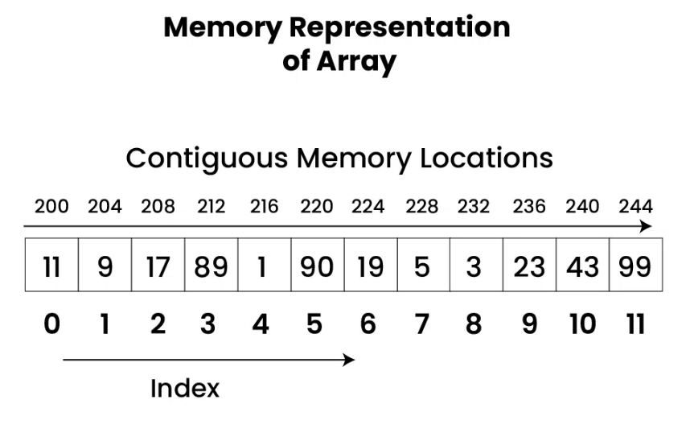
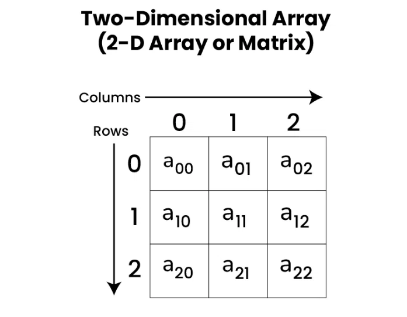
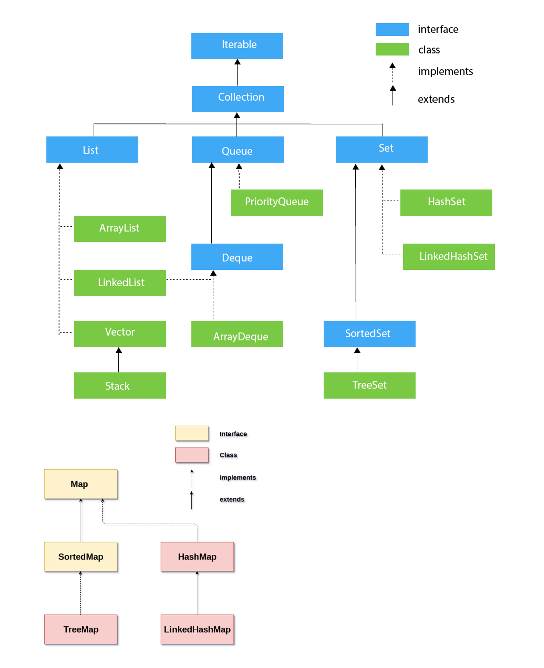
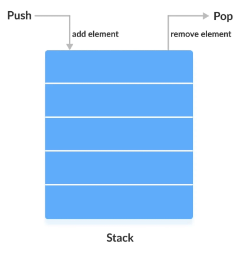
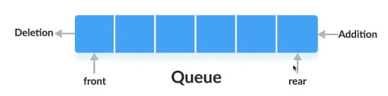

# Fundamentals for DSA

1. Insertion: add or put
2. Delete: remove
3. Traversal
4. Searching
5. Updating

## Arrays

## One Dimensional Array

	int[] count = new int[256];
	for(char ch : s.toCharArray()){
	    count[ch]++;
	}
	
	// Declaration
	int[] array;
	
	// Initialization
	array = new int[5]; // An array of 5 integers
	
	// Combined Declaration and Initialization
	int[] array = new int[5];

	int[] arr = {1,2,3,4,5};
	int[] arr = new int[]{1,2,3,4,5};
	int firstElement = array[0];
	array[1] = 10;
	
	for(int i=0; i<array.length; i++){
		System.out.println(array[i]);
	}
	
	for (int element : array) {
        System.out.println(element);
    }

	int[] num = {1,2,3,4,5,6,7,8,9}; 
	int index = Arrays.binarySearch(num, 4); //Make sure element is sorted
	Arrays.sort(num); //If not sorted
	Arrays.fill(num, -1); //Fill all array with same value 
	
	// reverse the array  
	Collections.reverse(Arrays.asList(a));  
	// reverse array using string builder  
	String[] arr = {"Hello", "World"};  
	StringBuilder reversed = new StringBuilder();  
	for (int i = arr.length; i > 0; i--) {  
	reversed.append(arr[i - 1]).append(" ");  
	};  
	String[] reversedArray = reversed.toString().split(" ");

## Two Dimensional Array

	// Combined Declaration and Initialization
	int[][] matrix = new int[3][3];

	int firstElement = matrix[0][0];
    matrix[1][2] = 10;

	for (int i = 0; i < matrix.length; i++) {
		for (int j = 0; j < matrix[i].length; j++) {
			System.out.println(matrix[i][j]);
		}
	}
	
	for (int[] row : matrix) {
		for (int element : row) {
			System.out.println(element);
		}
	}

	public class MatrixMultiplication {
		public static void main(String[] args) {
			int[][] matrix1 = {
				{1, 2, 3},
				{4, 5, 6}
			};
			int[][] matrix2 = {
				{7, 8},
				{9, 10},
				{11, 12}
			};
		
			int[][] result = multiplyMatrices(matrix1, matrix2);
			printMatrix(result);
		}
	
		public static int[][] multiplyMatrices(int[][] firstMatrix, int[][] secondMatrix) {
			int r1 = firstMatrix.length;
			int c1 = firstMatrix[0].length;
			int c2 = secondMatrix[0].length;
			int[][] product = new int[r1][c2];
			for (int i = 0; i < r1; i++) {
				for (int j = 0; j < c2; j++) {
					for (int k = 0; k < c1; k++) {
						product[i][j] += firstMatrix[i][k] * secondMatrix[k][j];
					}
				}
			}
			return product;
		}
	
		public static void printMatrix(int[][] matrix) {
			for (int[] row : matrix) {
				for (int column : row) {
					System.out.print(column + "    ");
				}
				System.out.println();
			}
		}
	}

## Collection Framework

### Iterator Interface

	Iterator<data-type> itr = list.iterator();

	public boolean hasNext(); //Returns true if the iterator has more elements 
	
	public Object next(); //Returns the element and moves to the next element.
	
	public void remove(); //Removes the last elements returned by the iterator.

### Collection Interface

	Collection<Integer> list = new ArrayList<>();
	Collection.min(list);
	Collection.max(list);
	Collection.frequency(list, element);
	Collection.sort(list);
	Collection.sort(list, Comparator.reserveOrder());

#### List Interface

ArrayList:

	List<Character> list = new ArrayList<>();
	List<Character> list = new ArrayList<>(10); //Initial Capacity increaseable

	list.add('A');  // boolean
	list.add('F');  // boolean
	list.add('G');  // boolean
	System.out.println(list);  // void (prints the list)
	
	list.add(0, 'B');  // void (inserts 'B' at index 0)
	System.out.println(list);  // void (prints the list)
	
	list.remove(1);  // E (removes the element at index 1 and returns it)
	System.out.println(list);  // void (prints the list)
	
	list.remove(Character.valueOf('B')); //Pass Element as object. boolean (removes the first occurrence of 'B' and returns true if successful)
	
	System.out.println(list);  // void (prints the list)
	
	list.get(1);  // E (returns the element at index 1)
	list.set(0, 'D'); // E (replaces the element at index and returns the old element)
	
	list.size();  // int (returns the number of elements in the list)
	list.isEmpty(); // boolean (returns true if the list is empty)
	list.contains('E'); // boolean (returns true if the list contains 'E')
	list.indexOf('A');  // int (returns index of the first occurrence or -1)
	  
	System.out.println(list);
	
	for(int i=0; i<list.size(); i++){
	    System.out.println(list.get(i));
	}
	
	for(Integer element: list){
	    System.out.println(element);
	}

	Iterator<String> iterator = list.iterator();
	while(iterator.hasNext()){
		iterator.next();		
	}
	
	ListIterator<String> listIterator = list.iterator();
	while(listIterator.hasNext()){
		listIterator.next();		
	}

	//Note: With iterator, we can iterate the list and remove the element simultaneously. Else it is not possible using list, array list etc.
	
	// Using toArray to get array of elements
	Object[] array = list.toArray();
	System.out.println("Array from list:");
	for (Object element : array) {
		System.out.print(element + " ");
	}

	System.out.println(); // Output: B C D
	// Using toArray with type parameter
	
	String[] stringArray = list.toArray(new String[0]);
	System.out.println("String array from list:");
	for (String element : stringArray) {
	    System.out.print(element + " ");
	}
	
	System.out.println(); // Output: B C D
	list.clear();
		

Linked List:

- Insert at head/ Insert as tail/ Insert at index
- Delete at head/ delete at tail/ delete at index

Code:

	List<Character> list = new LinkedList<>();
	List<Character> list = new LinkedList<>(10); //Initial Capacity increaseable

	list.add('A');  // boolean
	list.add('F');  // boolean
	list.add('G');  // boolean
	System.out.println(list);  // void (prints the list)
	
	list.add(0, 'B');  // void (inserts 'B' at index 0)
	System.out.println(list);  // void (prints the list)
	
	list.remove(1);  // E (removes the element at index 1 and returns it)
	System.out.println(list);  // void (prints the list)
	
	list.remove(Character.valueOf('B')); //Pass Element as object. boolean (removes the first occurrence of 'B' and returns true if successful)
	
	System.out.println(list);  // void (prints the list)
	
	list.get(1);  // E (returns the element at index 1)
	list.set(0, 'D'); // E (replaces the element at index and returns the old element)
	
	list.size();  // int (returns the number of elements in the list)
	list.isEmpty(); // boolean (returns true if the list is empty)
	list.contains('E'); // boolean (returns true if the list contains 'E')
	list.indexOf('A');  // int (returns index of the first occurrence or -1)
	  
	System.out.println(list);
	
	for(int i=0; i<list.size(); i++){
	    System.out.println(list.get(i));
	}
	
	for(Integer element: list){
	    System.out.println(element);
	}

	Iterator<String> iterator = list.iterator();
	while(iterator.hasNext()){
		iterator.next();		
	}
	
	ListIterator<String> listIterator = list.iterator();
	while(listIterator.hasNext()){
		listIterator.next();		
	}

	//Note: With iterator, we can iterate the list and remove the element simultaneously. Else it is not possible using list, array list etc.
	
	// Using toArray to get array of elements
	Object[] array = list.toArray();
	System.out.println("Array from list:");
	for (Object element : array) {
		System.out.print(element + " ");
	}

	System.out.println(); // Output: B C D 
	// Using toArray with type parameter
	
	String[] stringArray = list.toArray(new String[0]);
	System.out.println("String array from list:");
	for (String element : stringArray) {
	    System.out.print(element + " ");
	}
	
	System.out.println(); // Output: B C D
	list.clear();

	If,
	LinkedList<Character> list = new LinkedList<>();
	list.addFirst(E);
	list.addLast(E);
	list.removeFirst();
	list.removeLast();
	list.getFirst();
	list.getLast();

### Stack in Java

Use the concept of Last In First Out.  

	// Basic initialize  
	Stack<Integer> stack = new Stack<>();  
	stack.isEmpty(); // returns true/false  
	stack.peek(); // returns the top value but will not remove  
	stack.pop(); // retruns the top and remove it from the stack  
	stack.push();  
	stack.size(); // returns the size of the stack  
	stack.search(O);
	stack.toArray();  
	stack.toString();

### Queue in Java

First in first out

	// Basic initialization  
	Queue<Integer> queue = new LinkedList<>();  
	  
	queue.isEmpty(); // returns true/false  
	queue.peek(); // returns the first element of the queue and don't remove  
	queue.element(); -> Returns the head of the queue. Throws an exception if the queue is empty.
	  
	// Add item  
	queue.offer(10); // add end of the queue. don't throw exception  
	queue.add(10); // add end of the queue throw exception  
	  
	// Remove  
	queue.poll(); // return the first element and remove the first of the queue  
	queue.remove(); // same as poll but capable to throws an exception  
	  
	queue.size(); // returns the size of the queue  
	queue.toArray();

#### PriorityQueue

It uses heap data structure, where the top priority queue is entered into the queue and then queue  operations are performed.

	// Basic initialization  
	Queue<Integer> pQueue = new PriorityQueu<>() // By default ASC  
	
	// DSC  
	PriorityQueue<Integer> pQueue =  new PriorityQueue<Integer>(Collections.reverseOrder());  
	
	PriorityQueue<Integer> pQueue =  new PriorityQueue<Integer>((a, b) -> b - a);  
	  
	pQueue.isEmpty(); // returns true/false  
	  
	pQueue.peek(); // returns the first element of the queue and don't remove  
	  
	// Add item  
	pQueue.offer(10); // add end of the priority queue. don't throw exception  
	pQueue.add(10); // add end of the priority queue throw exception  
	  
	// Remove  
	pQueue.poll(); // return first item and remove first item of priority queue  
	pQueue.remove(); // same as poll but capable to throws an exception  
	  
	pQueue.size(); // returns the size of the queue  
	pQueue.toArray();

#### ArrayDequeue

Offer element from rear end and front end.  
E.g. Window proper

    ArrayDeque<Integer> arrayDeque = new ArrayDequeue<>();
    arrayDeque.offer(23);
    arrayDeque.offerFirst(12);
    arrayDeque.offerLast(45); 
    
    arrayDeque.peek();
    arrayDeque.peekFirst();
    arrayDeque.peekLast();
    
    arrayDeque.poll();
    arrayDeque.pollFirst();
    arrayDeque.pollLast();

## HashMap in Java

Java HashMap class inplements Map interface which allows storing data in <Key, Value> pair where keys are unique. If user tries to insert duplicate Key with same or different Value, it will replace the element (Value) of the corresponding Key.

- Key is unique and no duplication is allowed.
- HashMap allows one null key and multiple null values.
- HashMap is not synchronized, which means it is not thread-safe

HashMap class in found in the java.util package.

1. Java HashMap contains values based on the key.
2. Java HashMap contains only unique keys.
3. Java HashMap may have one null key and multiple null values.
4. Java HashMap is non synchronized.
5. Java HashMap maintains no order.
6. The initial default capacity of Java HashMap class is 16 with a load factor of 0.75.

Map Operations:

	// Basic initialization  
	public class HashMap<K,V> extends AbstractMap<K,V> implements Map<K,V>, Cloneable, Serializable
	
	Map<K, V> map = new HashMap<>();  
	Map<Integer, List<String>> map = new HashMap<>();  
	Map<Integer, List<String>> map = new HashMap<>(Capacity);  
	  
	map.size();
	map.isEmpty();
	map.clear();
	
	// Contains  
	map.containsKey(key); // Returns true if this map contains key.  
	map.containsValue(V); // Returns true if this map contains value.  
	  
	// Get item  
	map.get(key);  
	map.getOrDefault(key, defaultValue);  
	  
	// Put item  
	map.put(K,V); // Adding or putting elements at a given key forming a key-value pair
	
	map.putIfAbsent(K, V);
	map2.putAll(map1);
	  
	// Remove  
	map.remove(key); //remove a key-value pari by key
	map.remove(K,V);
	
	// Replace
	map.replace(K,V);
	map.replace(K,V,V1);
	map.replaceAll((k,v) -> "Ajay");
	  
	// Looping through the HashMap  
	for (Map.Entry<String,Integer> element : map.entrySet()) {  
	    String key = element.getKey();  
	    int value = element.getValue();  
	}  
	  
	// List of keys  
	map.keySet();
	List<String> list = new ArrayList<>(map.keySet()); // make list  
	  
	// List of values  
	map.values();
	List<Value> list = new ArrayList<Value>(map.values());  
	  
	// how to check the key is available or not  
	if(map.get(key) != null){  
		  // to do  
	}  
	  
	// array of map  
	Map<String, String>[] map = new HashMap[26];  
	for(int i = 0; i < 26; i++){  
		  map[i] = new HashMap<>();  
	}  
	
	for(int i = 0; i < 26; i++){  
		  for(int j = 0; j<10; j++){  
		    map[i].put("key"+j, "value"+j);  
		  }  
	}

	//Iterate over key-value pair
	for (Map.Entry<KeyType, ValueType> entry : map.entrySet()) {
	
		KeyType key = entry.getKey(); //1,2,3
		ValueType value = entry.getValue(); //One, Two, Three
		System.out.println(entry.getKey()+" -> "+entry.getValue()+" "+entry);
		// process the key and value
	}
	
	// Iterating over keys only
	for (Integer key : map.keySet()) {
		System.out.println("Key = " + key); //1,2,3
	}
	
	// Iterating over values only
	
	for (Integer value : map.values()) {
		System.out.println(value); //One, Two, Three
	}

### Map to Set

In order to traverse the map, we need to convert the map into a set first using Entry and entrySet().

	Set<Map.Entry<Integer, String>> set = map.entrySet(); // Converting map to set using map.entrySet()
	
	System.out.println("Set: "+set);

### Using Non-Generic Method

Calling iterator method which we use to traverse collection objects like Lists, Sets etc.

	Iterator itr = set.iterator();
	while(itr.hasNext()){
	
		Map.Entry entry = (Map.Entry) itr.next(); //Converting to Map.Entry so that we can get key and value separately.
	
		System.out.println(entry.getKey()+" -> "+entry.getValue());
	}

### Using Generic Method

	Map<K,V> map = new HashMap<>();
	
	for(Map.Entry<Integer, String> entry: map.entrySet()){
		System.out.println(entry.getKey()+" -> "+entry.getValue()+" "+entry);
	}

## Tree Map
	
	// Basic initialization  
	Map<String, Integer> treeMap = new TreeMap<>(); // by default ASC  
	Map<K, V> treeMap = new TreeMap<>(Collections.reverseOrder());  
	  
	treeMap.get(key)  
	treeMap.getOrDefault(Object key, V defaultValue);  
	  
	// Put item  
	treeMap.put(key, vlaue)  
	  
	// Remove  
	treeMap.remove(Object key)  
	  
	// Entry access  
	Map.Entry<K,V> entry = treeMap.firstEntry();  
	Map.Entry<K,V> entry = treeMap.lastEntry();  
	  
	// Looping through the HashMap  
	for (Map.Entry<String,Integer> element : treeMap.entrySet()) {  
	    String key = element.getKey();  
	    int value = element.getValue();  
	}  
	  
	// List of keys  
	treeMap.keySet()  
	List<String> list = new ArrayList<>(treeMap.keySet()); // makes list  
	  
	// List of valu  
	treeMap.values()  
	List<Value> list = new ArrayList<Value>(treeMap.values());

---

### HashSet in Java

Element can be inserted only once. So no duplicate value is provided. Order doesn't matter.  
Operations are mainly O(1).
For objects, set doesn't find unique values, like new Student(1, "Varun") and new Student(1, "Varun"),  to identify unique objects, we have hashCode() and equals()  
Methods: add(E), remove(O), isEmpty(), contains(O), size(), clear()

	// Basic Initialization  
	Set<String> set= new HashSet<>();  
	  
	set.size();  
	set.add()  
	set.contains()  
	set.remove(Object o) // Removes the element from this set if it's present.  
	  
	set.clear();  
	set.isEmpty();  
	  
	// Looping through  
	for (String s : set) {  
		System.out.println(s);  
	}

#### LinkedHashSet

Linked HashSet: Maintain the order

#### TreeSet

TreeSet: Sorted Set (Binary Search Tree)  
Operations are mainly O(log n)  
It uses comparator to compare two objects, not hashCode() or equals()

	Set<Integer> treeSet = new TreeSet<Integer>() // default ASC  
	// reverse order  
	TreeSet<Integer> treeSet = new TreeSet<Integer>(  
		new Comparator<Integer>(){  
			public int compare(Integer i1,Integer i2){  
				return i2.compareTo(i1);  
			}  
		}
	);  
	  
	  
	treeSet.size();  
	treeSet.add()  
	treeSet.contains()  
	treeSet.remove(Object o) //Removes the element from this set if present.  
	  
	treeSet.clear();  
	treeSet.isEmpty();  
	  
	treeSet.first() // Returns the first element currently in this set.  
	treeSet.last()  
	  
	// Retrieves and removes the first element, or  
	// returns null if this set is empty  
	treeSet.pollFirst()  
	treeSet.pollLast()

---

### String Builder

	// Basic initialization  
	StringBuilder sb = new StringBuilder();  
	StringBuilder sb = new StringBuilder("Hello world"); // accept string  
	  
	sb.length()  
	sb.reverse();  
	sb.toString();  
	  
	// Add  
	sb.append('c'); // adding char  
	sb.append("Stirng") // adding string  
	sb.append(int num) // adding number, float  
	  
	sb.charAt(int index) // Returns the char value at that index  
	sb.setCharAt(index, 'a'); // set the char  
	sb.indexOf(String str) // return index or -1  
	sb.toString().equals(sbGoal.toString()); // equals  
	  
	//split  
	String str = sb.toString();  
	String strArr[] = str.split(":");  
	  
	//Int to String  
	int i=200;  
	String s=String.valueOf(i);  
	  
	// string to int  
	String s="200";  
	int value = Integer.parseInt(s);  
	  
	// Char array to string;  
	char ch_arr[] = {'H','e','l','l','o',' ','W','o','r','l','d','!'};  
	String str1 = new String(ch_arr);  
	System.out.println("String: "+ str1);  
	  
	// char array to string builder  
	char ch_arr[] = {'J','a','v','a',' ','P','r','o','g','r','a','m'};  
	StringBuilder sb_obj = new StringBuilder();  
	
	for(int i = 0; i < ch_arr.length; i++){  
		sb_obj.append(ch_arr[i]);  
	}  
	  
	  
	int[] frequency = new int[26];  
	for (char ch : s.toCharArray()) {  
		frequency[ch - 'a'] += 1;  
		if (frequency[ch - 'a'] == 2) {  
			return true;  
		}  
	}

