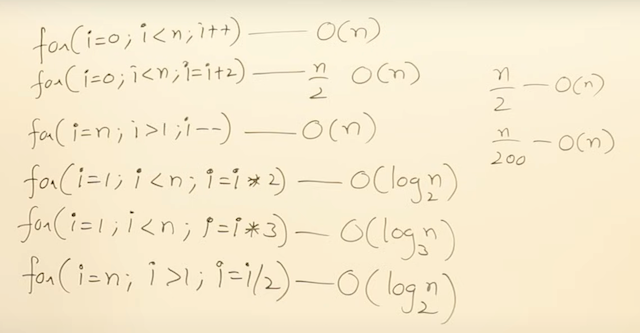
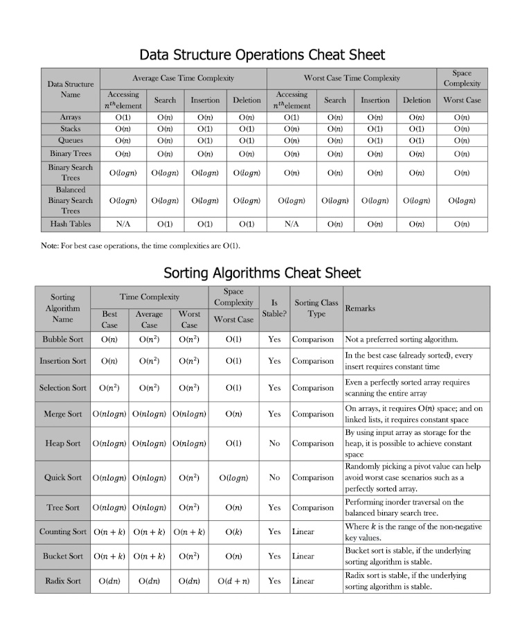
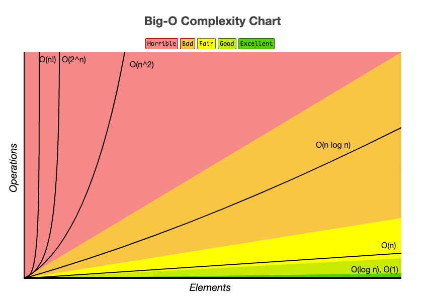
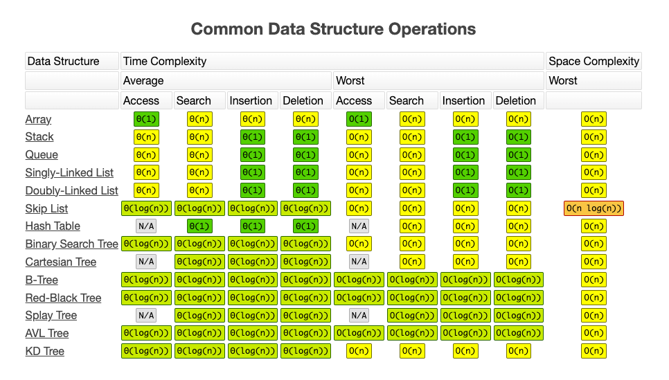
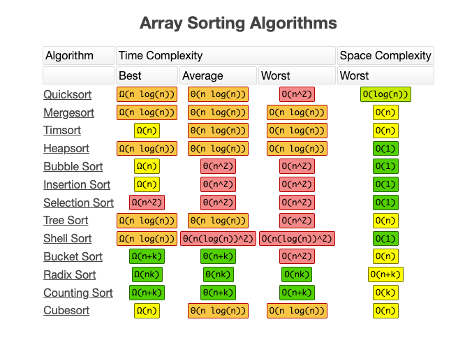
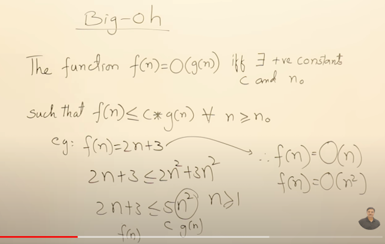

# Time and Space Complexity

1. Basic time complexity
    
    
    for(i=0; i<n; i++){ -------- n+1 times
       //statement; ------------ n times
    }
    Time Complexity is O(n)

    for(i=n; i>0; i--){
        //statement;
    }
    Time Complexity is still O(n)

    for(i=n; i>0; i=i-2){ //If substraction or addition (incrementing or decrementing) then it is division or multiplication
        //statement; -------------- n/2 times
    }
    Time Complexity is still O(n/2)
    

    for(i=n; i>0; i=i-20){ 
        //statement; -------------- n/20 times
    }
    Time Complexity is still O(n/20)
     
   
2. O(n^2) time complexity
   

    for(i=0; i<n; i++){ -------------- n times
        for(j=0; j<n; j++){ ------------ n*(n) times
            //Statement
        }
    }
    Time Complexity is O(n^2)

3. O(n^2) time complexity

    for(i=0; i<n; i++){                         i       j       No. of times             
        for(j=0; j<i; j++){                     0       0           0
            //Statement                         1       0           1
        }                                       2       0,1         2
    }                                           3       0,1,3       3
    Time Complexity is O(n^2)                   n       n-1         n 

    1+2+3+4+...+n = n(n+1)/2 = O(n^2)
    

4. O(sqrt(n))
    
                                    
    for(i=1; p<=n; i++){            i       p       
        p=p+i;                      1       O+1=1
    }                               2       0+1+2=3
                                    3       0+1+2+3=6
                                    k       1+2+3+4+...+k
    Assume p > n
    p = k(k+1)/2
    k(k+1)/2 > n
    k^2 > n
    k > sqrt(n)

    Time Complexity is O(sqrt(n))

5. O(log n) with multiplication

    for(i=1; i<n; i=i*2){ //If multiplication then result is logarithmic
        statement;
    }

    Assume i>=n
           i = 2^k
           2^k >= n
           k = log n (base 2)

    This uses i = 1 x 2 x 2 x 2 x 2 ... = n
    2^k = n
    Time Complexity is O(log n) 

6. O(log n) with division

    for(i=1; i<n; i=i/2){ //If division then result is logarithmic
        statement;
    }
    Time Complexity is O(log n)

7. O(sqrt(n)) when it is i*i

    for(i=0; i*i<n; i++){
        statement;
    }

    Time Complexity is O(sqrt(n))

8. O(2n) -> O(n)

    
    for(i=0; i<n; i++){ -------------- n times
        //Statement
    }

    for(j=0; j<n; j++){ ------------ (n) times
        //Statement
    }

    Time Complexity is O(n)

9.

    for(i=0; i<n; i++){ -------------- n times
        p++; --------------- log n
    }
    
    for(j=0; j<p; j++){ ------------ (p) times
        //Statement --------------- log p
    }
    p = log n
    O(log p)
    Time Complexity is O(log(log n))

10.

    for(i=0; i<n; i++){ -------------- n times
        for(j=0; j<n; j=j*2){ ------------ (n log n) times
            //Statement
        }
    }
    
    Time Complexity is O(nlog n)

## Formulas

Note: 'n' is the limit where the condition finally ends and determines how many times the loop executes before reaching 'n'.

## Time Complexity Cheatsheet

### Note: https://www.bigocheatsheet.com/

# Asymptotic Notations

1. Big-Oh notation: Upper bound of a function
2. Big-Omega notation: Lower bound of a function
3. Big-Theta notation: Average bound of a function

### Big-Oh 

## Introduction
Big O notation is a mathematical notation used to describe the upper bound of an algorithm's runtime or space requirements in terms of the size of the input. It helps in understanding the worst-case scenario of an algorithm's efficiency.

## Common Big O Notations

1. **O(1)**: Constant Time
2. **O(log n)**: Logarithmic Time
3. **O(n)**: Linear Time
4. **O(n log n)**: Linearithmic Time
5. **O(n^2)**: Quadratic Time
6. **O(2^n)**: Exponential Time
7. **O(n!)**: Factorial Time

## Examples and Diagrams

### 1. O(1) - Constant Time

**Example**: Accessing an element in an array by index.

    int getFirstElement(int[] array) {
        return array[0];
    } 

    Regardless of the array size, the time to access the first element is constant.

### 2. O(log n) - Logarithmic Time

Example: Binary search in a sorted array.

    int binarySearch(int[] array, int target) {
        int low = 0;
        int high = array.length - 1;
        while (low <= high) {
            int mid = low + (high - low) / 2;
            if (array[mid] == target) {
                return mid;
            } else if (array[mid] < target) {
                low = mid + 1;
            } else {
                high = mid - 1;
            }
        }
        return -1;
    }

The number of operations reduces by half with each step.

### 3. O(n) - Linear Time

Example: Finding the maximum element in an array.

    int findMax(int[] array) {
        int max = array[0];
        for (int i = 1; i < array.length; i++) {
            if (array[i] > max) {
                max = array[i];
            }
        }
        return max;
    }

The time taken increases linearly with the size of the input.

### 4. O(n log n) - Linearithmic Time

Example: Merge sort algorithm.

    void mergeSort(int[] array, int left, int right) {
        if (left < right) {
            int mid = left + (right - left) / 2;
            mergeSort(array, left, mid);
            mergeSort(array, mid + 1, right);
            merge(array, left, mid, right);
        }
    }
    
    void merge(int[] array, int left, int mid, int right) {
        // Merging logic
    }

The time taken grows at a rate proportional to (n log n).

### 5. O(n^2) - Quadratic Time

Example: Bubble sort algorithm.

    void bubbleSort(int[] array) {
        for (int i = 0; i < array.length - 1; i++) {
            for (int j = 0; j < array.length - i - 1; j++) {
                if (array[j] > array[j + 1]) {
                    int temp = array[j];
                    array[j] = array[j + 1];
                    array[j + 1] = temp;
                }
            }
        }
    }

The time taken increases quadratically with the size of the input.

### 6. O(2^n) - Exponential Time

Example: Solving the Tower of Hanoi problem.

    void towerOfHanoi(int n, char fromRod, char toRod, char auxRod) {
        if (n == 1) {
            System.out.println("Move disk 1 from rod " + fromRod + " to rod " + toRod);
            return;
        }
        towerOfHanoi(n - 1, fromRod, auxRod, toRod);
        System.out.println("Move disk " + n + " from rod " + fromRod + " to rod " + toRod);
        towerOfHanoi(n - 1, auxRod, toRod, fromRod);
    }

The time taken doubles with each additional input element.

### 7. O(n!) - Factorial Time

Example: Generating all permutations of a string.

    void permute(String str, int l, int r) {
        if (l == r) {
            System.out.println(str);
        } else {
            for (int i = l; i <= r; i++) {
                str = swap(str, l, i);
                permute(str, l + 1, r);
                str = swap(str, l, i);
            }
        }
    }

    String swap(String a, int i, int j) {
        char temp;
        char[] charArray = a.toCharArray();
        temp = charArray[i];
        charArray[i] = charArray[j];
        charArray[j] = temp;
        return String.valueOf(charArray);
    }

The time taken increases factorially with the size of the input.

Conclusion:

Big O notation provides a high-level understanding of the efficiency of algorithms in terms of time and space complexity. Understanding these notations helps in choosing the most efficient algorithm for a given problem, especially when dealing with large inputs.

## References:
- https://www.youtube.com/watch?v=A03oI0znAoc&list=PLDN4rrl48XKpZkf03iYFl-O29szjTrs_O&index=11
- 
