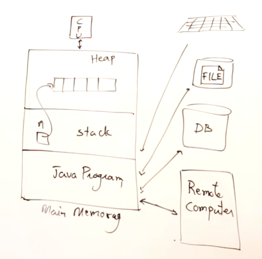

# Arrays




## One Dimensional Array


## Two Dimensional Array


## Find occurrences of each character.
```
int[] count = new int[256];
for(char ch : s.toCharArray()){
    count[ch]++;
}
```

count[ch]++: For each character ch in the string, this line increments the value at the 
index corresponding to the ASCII value of ch. Each position in the array represents an 
ASCII value, so count[65], for example, would count how many times the character 'A' (ASCII 65) 
appears in the string.


Common pattern used especially in problems involving calculations for pairings or ensuring even increments

    result = result + count/2 * 2;

## Arrays

### Definition
An array is a collection of elements, each identified by an index or key. Arrays are used to store multiple values in a single variable, instead of declaring separate variables for each value.

### Declaration and Initialization
In Java, arrays can be declared and initialized as follows:

        // Declaration
        int[] array;
        
        // Initialization
        array = new int[5]; // An array of 5 integers
        
        // Combined Declaration and Initialization
        int[] array = new int[5];


Accessing Elements
Array elements are accessed using their index, with the first element at index 0.

    int firstElement = array[0];
    array[1] = 10;

Looping Through Arrays
You can loop through array elements using a for loop or enhanced for loop.

    for (int i = 0; i < array.length; i++) {
        System.out.println(array[i]);
    }

    for (int element : array) {
        System.out.println(element);
    }

Common Operations
1. Finding the length: array.length
2. Copying arrays: System.arraycopy(sourceArray, 0, destinationArray, 0, sourceArray.length);
3. Sorting arrays: Arrays.sort(array);

### Two-Dimensional Arrays

Definition
A two-dimensional array, or matrix, is an array of arrays. It can be thought of as a table with rows and columns.

#### Declaration and Initialization
In Java, two-dimensional arrays can be declared and initialized as follows:

    // Declaration
    int[][] matrix;
    
    // Initialization
    matrix = new int[3][3]; // A 3x3 matrix
    
    // Combined Declaration and Initialization
    int[][] matrix = new int[3][3];

#### Accessing Elements
Matrix elements are accessed using their row and column indices.

    int firstElement = matrix[0][0];
    matrix[1][2] = 10;

#### Looping Through Two-Dimensional Arrays
You can loop through the elements of a matrix using nested for loops.

    for (int i = 0; i < matrix.length; i++) {
        for (int j = 0; j < matrix[i].length; j++) {
            System.out.println(matrix[i][j]);
        }
    }

    for (int[] row : matrix) {
        for (int element : row) {
            System.out.println(element);
        }
    }

Common Operations
1. Finding the number of rows: matrix.length
2. Finding the number of columns in a row: matrix[rowIndex].length
3. Filling a matrix: Arrays.fill(matrix[rowIndex], value);

Example: Matrix Multiplication
Here is an example of multiplying two matrices:

    public class MatrixMultiplication {
        public static void main(String[] args) {
            int[][] matrix1 = {
                {1, 2, 3},
                {4, 5, 6}
            };
            int[][] matrix2 = {
                {7, 8},
                {9, 10},
                {11, 12}
            };
        
            int[][] result = multiplyMatrices(matrix1, matrix2);
            printMatrix(result);
        }

        public static int[][] multiplyMatrices(int[][] firstMatrix, int[][] secondMatrix) {
            int r1 = firstMatrix.length;
            int c1 = firstMatrix[0].length;
            int c2 = secondMatrix[0].length;
            int[][] product = new int[r1][c2];
            for (int i = 0; i < r1; i++) {
                for (int j = 0; j < c2; j++) {
                    for (int k = 0; k < c1; k++) {
                        product[i][j] += firstMatrix[i][k] * secondMatrix[k][j];
                    }
                }
            }
            return product;
        }

        public static void printMatrix(int[][] matrix) {
            for (int[] row : matrix) {
                for (int column : row) {
                    System.out.print(column + "    ");
                }
                System.out.println();
            }
        }
    }


Summary
Arrays are used to store multiple values in a single variable.
Two-dimensional arrays are arrays of arrays, used to store data in a table-like structure.
Elements in both arrays and two-dimensional arrays are accessed using indices.
Common operations include finding length, copying, and sorting for arrays, and finding number of rows and columns, and filling for matrices.


