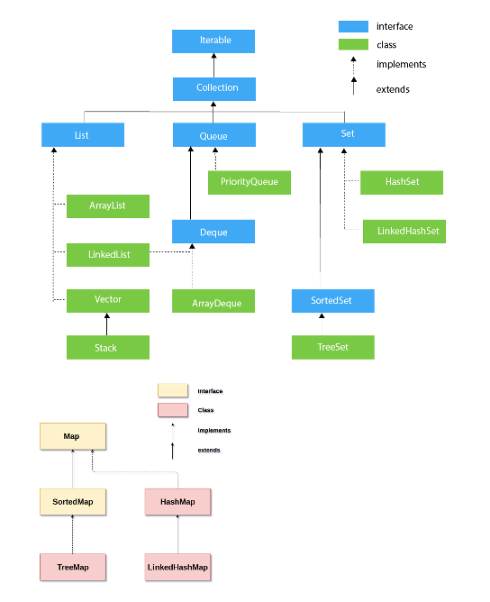
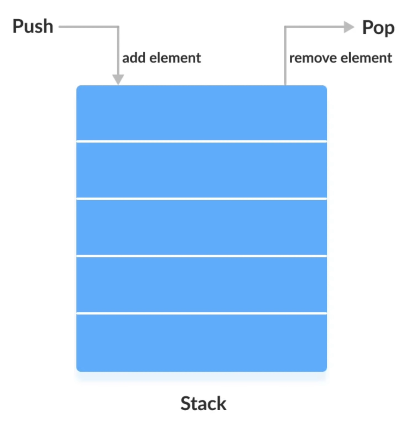
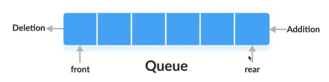

# Collection Framework

Java Collection framework provides many interfaces (Iterable, Collection, Set, List, Queue, Deque) and classes (ArrayList, Vector, LinkedList, PriorityQueue, HashSet, LinkedHashSet, TreeSet).



Interface is denoted as ```<I>```. 

- Iterable ```<I>```
  - Collection ```<I>```
    - List ```<I>```
      - ArrayList
      - LinkedList
      - Stack
    - Queue ```<I>```
      - LinkedList
      - Dequeue ```<I>```
        - ArrayDequeue
      - PriorityQueue
    - Set ```<I>```
      - SortedSet ```<I>```
        - TreeSet
      - HashSet
      - LinkedHashSet

- Map ```<I>```
    - HashMap
    - LinkedHashMap
    - Sorted Map ```<I>```
      - TreeMap


### Iterator Interface
Iterators are used to iterate over collections such as lists, sets, and other data structures
which implement Iterable interface.
```
Iterator<data-type> itr = list.iterator();
```

now itr can access below methods:

```
public boolean hasNext(); //It returns true if the iterator has more elements otherwise it returns false.
public Object next(); //It returns the element and moves the cursor pointer to the next element.
public void remove(); //It removes the last elements returned by the iterator.
```

#### Note: 
With iterator, we can iterate the list and remove the element simultaneously. Else it is not possible using list, array list etc. 

### Collection Interface

- Collection Interfaces
  - List Interface
    - List<Data-Type> list = new ArrayList<>();
    - List<Data-Type> list = new LinkedList<>();
    - List<Data-Type> stack = new Stack<>();
  - Set Interface
    - Set<Data-Type> set = new HashSet<>();
    - Set<Data-Type> set = new LinkedHashSet<>();
    - Set<Data-Type> set = new TreeSet<>(); //TreeSet implements SortedSet Interface extends Set Interface
  - Queue Interface
    - Queue<Data-Type> queue = new LinkedList<>();
    - Queue<Data-Type> queue = new ArrayDequeue(); //ArrayDequeue implements Dequeue Interface extends Queue Interface
    - Queue<Data-Type> queue = new PriorityQueue();

Collection Interface Methods
Here's a comprehensive table summarizing the methods in Java's Collection framework along with their time complexity (TC), space complexity (SC), and descriptions:

| Method No. | Method Signature                                | Description                                                                                   | Time Complexity                | Space Complexity  | 
|------------|-------------------------------------------------|-----------------------------------------------------------------------------------------------|--------------------------------|-------------------|
| 01         | `boolean add(E e)`                              | Inserts an element into the collection                                                        | O(1) [O(n) if resizing needed] | O(1)              |
| 02         | `boolean addAll(Collection<? extends E> c)`     | Adds all of the elements in the specified collection to this collection                       | O(n)                           | O(n)              |
| 03         | `boolean remove(Object o)`                      | Deletes an element from the collection                                                        | O(n)                           | O(1)              |
| 04         | `boolean removeAll(Collection<?> c)`            | Removes all of this collection's elements that are also contained in the specified collection | O(n*m)                         | O(1)              |
| 05         | `boolean removeIf(Predicate<? super E> filter)` | Removes all of the elements of this collection that satisfy the given predicate               | O(n)                           | O(1)              |
| 06         | `boolean retainAll(Collection<?> c)`            | Retains only the elements in this collection that are contained in the specified collection   | O(n*m)                         | O(1)              |
| 07         | `void clear()`                                  | Clears all elements from the collection                                                       | O(n)                           | O(1)              |
| 08         | `boolean isEmpty()`                             | Checks if the collection is empty                                                             | O(1)                           | O(1)              |
| 09         | `boolean contains(Object o)`                    | Checks if the specified object is present in the collection                                   | O(n)                           | O(1)              |
| 10         | `boolean containsAll(Collection<?> c)`          | Checks if the collection contains all elements in the specified collection                    | O(n*m)                         | O(1)              |
| 11         | `boolean equals(Object o)`                      | Compares the specified object with this collection for equality                               | O(n)                           | O(1)              |
| 12         | `int size()`                                    | Returns the number of elements in the collection                                              | O(1)                           | O(1)              |
| 13         | `Iterator<E> iterator()`                        | Returns an iterator over the elements in the collection                                       | O(1)                           | O(1)              |
| 14         | `Object[] toArray()`                            | Returns an array containing all of the elements in the collection                             | O(n)                           | O(n)              |
| 15         | `int hashCode()`                                | Returns the hash code value for the collection                                                | O(n)                           | O(1)              |

This table is a concise reference that includes all key operations you might use while working with Java collections. It provides clear insights into the computational efficiency (both time and space) of these operations, aiding in better understanding and optimization of Java applications.

####
Some more Collection methods
```
List<Integer> list = new LinkedList<>();

Collection.min(list);
Collection.max(list);
Collection.frequency(list, element);
Collection.sort(list);
Collection.sort(list, Comparator.reverseOrder());
```

### Comparator and Comparable


### Arrays Class
Used to do over a primitive array
```
int[] num = {1,2,3,4,5,6,7,8,9}; 
int index = Arrays.binarySearch(num, 4); //Make sure element is sorted
Arrays.sort(num); //If not sorted
Arrays.fill(num, -1); //Fill all array with same value 
```

### List
##### Note:
```
In Java, both `LinkedList` and `ArrayList` implement the `List` interface, 
but they do so in fundamentally different ways. An `ArrayList` is implemented 
as a resizable array, while a `LinkedList` is implemented as a doubly linked list.
```

Using an empty array list with no initial capacity & WITH specified capacity

```
- List<Data-Type> arrayList = new ArrayList<>();
- List<Data-Type> arrayList = new ArrayList<>(Capacity);
```

#### List Operations

- **Add Elements:**
  - `add(E e)`: Appends the specified element to the end of the list.
  - `add(int index, E element)`: Inserts the specified element at the specified position in the list.
  - `addFirst(E e)`: Inserts the specified element at the beginning of the list.
  - `addLast(E e)`: Appends the specified element to the end of the list.

- **Remove Elements:**
  - `remove(int index)`: Removes the element at the specified position in the list.
  - `remove(Object o)`: Removes the first occurrence of the specified element from the list.
  - `removeFirst()`: Removes and returns the first element from the list.
  - `removeLast()`: Removes and returns the last element from the list.

- **Access Elements:**
  - `get(int index)`: Returns the element at the specified position in the list.
  - `getFirst()`: Returns the first element in the list.
  - `getLast()`: Returns the last element in the list.
  - `set(int index, E element)`: Replaces the element at the specified position in the list with the specified element.

- **Size, Check, and Search:**
  - `size()`: Returns the number of elements in the list.
  - `isEmpty()`: Returns `true` if the list contains no elements.
  - `contains(Object o)`: Returns `true` if the list contains the specified element.
  - `indexOf(Object o)`: Returns the index of the first occurrence of the specified element, or `-1` if the list does not contain the element.

- **Iterate:**
  - `iterator()`: Returns an iterator over the elements in the list.
  - `listIterator()`: Returns a list iterator over the elements in the list.

- **Other:**
  - `clear()`: Removes all the elements from the list.
  - `toArray()`: Returns an array containing all the elements in the list in proper sequence.
  - `peek()`, `poll()`, and other Queue-related operations, since `LinkedList` also implements the `Queue` interface.


#### To Summarize

| **Method**                    | **Return Type**    | **Used in ArrayList**               | **Used in LinkedList**  |
|-------------------------------|--------------------|-------------------------------------|-------------------------|
| **Add Elements**              |                    |                                     |                         |
| `add(E element)`              | `boolean`          | Yes T(O(1) amortized) S(O(1))       | Yes T(O(1)) S(O(1))     |
| `add(int index, E element)`   | `void`             | Yes T(O(n)) S(O(1))                 | Yes T(O(n)) S(O(1))     |
| `addFirst(E element)`         | `void`             | No                                  | Yes T(O(1)) S(O(1))     |
| `addLast(E element)`          | `void`             | No                                  | Yes T(O(1)) S(O(1))     |
| **Remove Elements**           |                    |                                     |                         |
| `remove(int index)`           | `E`                | Yes T(O(n)) S(O(1))                 | Yes T(O(n)) S(O(1))     |
| `remove(Object object)`       | `boolean`          | Yes T(O(n)) S(O(1))                 | Yes T(O(n)) S(O(1))     |
| `removeFirst()`               | `E`                | No                                  | Yes T(O(1)) S(O(1))     |
| `removeLast()`                | `E`                | No                                  | Yes T(O(1)) S(O(1))     |
| **Access Elements**           |                    |                                     |                         |
| `get(int index)`              | `E`                | Yes T(O(1)) S(O(1))                 | Yes T(O(n)) S(O(1))     |
| `getFirst()`                  | `E`                | No                                  | Yes T(O(1)) S(O(1))     |
| `getLast()`                   | `E`                | No                                  | Yes T(O(1)) S(O(1))     |
| `set(int index, E element)`   | `E`                | Yes T(O(1)) S(O(1))                 | Yes T(O(n)) S(O(1))     |
| **Size, Check, and Search**   |                    |                                     |                         |
| `size()`                      | `int`              | Yes T(O(1)) S(O(1))                 | Yes T(O(1)) S(O(1))     |
| `isEmpty()`                   | `boolean`          | Yes T(O(1)) S(O(1))                 | Yes T(O(1)) S(O(1))     |
| `contains(Object object)`     | `boolean`          | Yes T(O(n)) S(O(1))                 | Yes T(O(n)) S(O(1))     |
| `indexOf(Object object)`      | `int`              | Yes T(O(n)) S(O(1))                 | Yes T(O(n)) S(O(1))     |
| **Iterate**                   |                    |                                     |                         |
| `iterator()`                  | `Iterator<E>`      | Yes T(O(1)) S(O(1))                 | Yes T(O(1)) S(O(1))     |
| `listIterator()`              | `ListIterator<E>`  | Yes T(O(1)) S(O(1))                 | Yes T(O(1)) S(O(1))     |
| **Other**                     |                    |                                     |                         |
| `clear()`                     | `void`             | Yes T(O(n)) S(O(1))                 | Yes T(O(n)) S(O(1))     |
| `toArray()`                   | `Object[]`         | Yes T(O(n)) S(O(n))                 | Yes T(O(n)) S(O(n))     |
| `peek()`                      | `E`                | No                                  | Yes T(O(1)) S(O(1))     |
| `poll()`                      | `E`                | No                                  | Yes T(O(1)) S(O(1))     |
| `subList(fromIndex, toIndex)` | `List<E>`          | Yes T(O(1)) S(O(1))                 | Yes T(O(1)) S(O(1))     |

#### Key Differences

- **Performance:**
  - `ArrayList` is fast for accessing data as it provides O(1) time complexity for random access.
  - `LinkedList` is generally slower to access specific elements but faster for adding and removing elements, especially at the beginning or end of the list, as these operations are generally O(1) time complexity.

- **Memory Overhead:**
  - `ArrayList` has less memory overhead because it stores elements in a contiguous block of memory.
  - `LinkedList` uses more memory per element due to the need for additional pointer fields for each element (previous and next references in a doubly linked list).

#### When to Use Each

- **Use `ArrayList`:**
  - When you need fast access to elements using an index.
  - You're adding elements only to the end of the list.

- **Use `LinkedList`:**
  - When you frequently add or remove elements from the beginning or middle of the list.
  - When you use the list as a queue or stack, and you need operations such as `addFirst()`, `removeFirst()`, `addLast()`, and `removeLast()`.

### Loops

```
List<Integer> list = new ArrayList<>()/ new LinkedList<>();

for(int i=0; i<list.size(); i++){
    System.out.println(list.get(i));
}

for(Integer element: list){
    System.out.println(element);
}

Iterator it = list.iterator();
while(it.hasNext()){
    System.out.println(it.next());
}
```

### Stack in Java

Use the concept of Last In First Out.


Here is the table format that lists the methods used in a typical Stack implementation, along with their space and time complexity:

| Method                         | Time Complexity | Space Complexity |
|--------------------------------|-----------------|------------------|
| `boolean empty() or isEmpty()` | O(1)            | O(1)             |
| `E push(E)`                    | O(1)            | O(1)             |
| `E pop()`                      | O(1)            | O(1)             |
| `E peek()`                     | O(1)            | O(1)             |
| `int search(Object)`           | O(n)            | O(1)             |


### Queue in Java
First in first out



```
add() -> Insert the specified element into the queue If the task is successful, it 
returns true if not it throws an exception.

offer() -> Insert the specified element into the queue If the task is successful, it 
returns true if not it returns false. 

element() -> Returns the head of the queue. Throws an exception if the queue is empty.
peek() -> Returns the head of the queue. Returns null if the queue is empty.

remove() -> Remove and returns the head of the queue. Throws an exception if the queue is empty.
poll() -> Remove and returns the head of the queue. Returns null if the queue is empty.
```

#### PriorityQueue
It uses heap data structure, where the top priority queue is entered into the queue and then queue
operations are performed.

#### ArrayDequeue
Offer element from rear end and front end.
E.g. Window proper

```
ArrayDeque<Integer> arrayDeque = new ArrayDequeue<>();
arrayDeque.offer(23);
arrayDeque.offerFirst(12);
arrayDeque.offerLast(45); 

arrayDeque.peek();
arrayDeque.peekFirst();
arrayDeque.peekLast();

arrayDeque.poll();
arrayDeque.pollFirst();
arrayDeque.pollLast();
```

### HashSet in Java
Element can be inserted only once. So no duplicate value is provided. Order doesn't matter.
Operations are mainly O(1)
For objects, set doesn't find unique values, like new Student(1, "Varun") and new Student(1, "Varun"),
to identify unique objects, we have hashCode() and equals()
Methods: add(E), remove(O), isEmpty(), contains(O), size(), clear()

#### LinkedHashSet
Linked HashSet: Maintain the order

#### TreeSet
TreeSet: Sorted Set (Binary Search Tree)
Operations are mainly O(log n)
It uses comparator to compare two objects, not hashCode() or equals()

---------------------------------------------------------------------------------------------------------------------------------------------------------------
# HashMap in Java

Java HashMap class inplements Map interface which allows storing data in <Key, Value> pair where keys are unique. If user tries to insert duplicate Key with same or different Value, it will replace the element (Value) of the corresponding Key.

- Key is unique and no duplication is allowed.
- HashMap allows one null key and multiple null values.
- HashMap is not synchronized, which means it is not thread-safe

HashMap class in found in the java.util package.

1. Java HashMap contains values based on the key.
2. Java HashMap contains only unique keys.
3. Java HashMap may have one null key and multiple null values.
4. Java HashMap is non synchronized.
5. Java HashMap maintains no order.
6. The initial default capacity of Java HashMap class is 16 with a load factor of 0.75.

## Basic HashMap Operations

### A. HashMap extends AbstractMap which implements Map interface

- public class HashMap<K,V> extends AbstractMap<K,V> implements Map<K,V>, Cloneable, Serializable

### B. Create a map object

- Map<K,V> map = new HashMap<>();
- Map<K,V> map = new HashMap<>(int initialCapacity);

### C. Add Key and Value in a HashMap -> V put(K,V)

- map.put(K,V); // Adding or putting elements at a given key forming a key-value pair.
- map.putIfAbsent(K, V);
- map2.putAll(map1);

### D. Contains Key and value -> boolean containsKey(K) or boolean containsValue(V)

- map.containsKey(K); //retrieve the value associated with a specific key
- map.containsValue(V); //retrieve the key associated with a specific value

### E. Get method -> V get(K)

- ValueType value = map.get(K); //retrieve the value associated with a specific key
- ValueType value = map.getOrDefault(key, defaultValue); //get a value or a default if the key is not found

### F. Is the map empty -> boolean isEmpty()

- map.isEmpty();

### G. Remove K-V pair -> V remove(K)

- map.remove(K); //remove a key-value pair by key
- map.remove(K,V);

### H. Replace V -> V replace(K,V)

- map.replace(K,V);
- map.replace(K,V,V1);
- map.replaceAll((k,v) -> "Ajay");

### I. Size of the Map -> int size()

- map.size(); //number of key-value pairs

### J. Clear the Map -> void clear()

- map.clear();

### K. IsEmpty() -> check if the map is empty

boolean isEmpty = map.isEmpty();

### L. Iterate over map

```
HashMap<Integer, String> map = new HashMap<>();
map.put(1, "One");
map.put(2, "Two");
map.put(3, "Three");
```

//Iterate over key-value pair
```
for (Map.Entry<KeyType, ValueType> entry : map.entrySet()) {
    KeyType key = entry.getKey(); //1,2,3
    ValueType value = entry.getValue(); //One, Two, Three
    System.out.println(entry.getKey()+" -> "+entry.getValue()+" "+entry);
    // process the key and value
}
```

// Iterating over keys only
```
for (Integer key : map.keySet()) {
    System.out.println("Key = " + key); //1,2,3
}
```

// Iterating over values only
```
for (Integer value : map.values()) {
    System.out.println(value); //One, Two, Three
}
```


## Iteration in Map (Advanced)

### Map to Set

In order to traverse the map, we need to convert the map into a set first using Entry and entrySet().

- Set<Map.Entry<Integer, String>> set = map.entrySet(); // Converting map to set using map.entrySet()
- System.out.println("Set: "+set);

### Using Non-Generic Method

Calling iterator method which we use to traverse collection objects like Lists, Sets etc.

- Iterator itr = set.iterator();
```
while(itr.hasNext()){
    Map.Entry entry = (Map.Entry) itr.next(); //Converting to Map.Entry so that we can get key and value separately.
    System.out.println(entry.getKey()+" -> "+entry.getValue());
}
```

### Using Generic Method (Point L in Basic HashMap Operations)
```
Map<K,V> map = new HashMap<>();
for(Map.Entry<Integer, String> entry: map.entrySet()){
    System.out.println(entry.getKey()+" -> "+entry.getValue()+" "+entry);
}
```

## Comparing By Key - Map

- map.entrySet().stream().sorted(Map.Entry.comparingByKey()).forEach(System.out::println);

- map.entrySet().stream().sorted(Map.Entry.comparingByKey(Comparator.reverseOrder())).forEach(System.out::println);

- map.entrySet().stream().sorted(Map.Entry.comparingByValue()).forEach(System.out::println);

- map.entrySet().stream().sorted(Map.Entry.comparingByValue(Comparator.reverseOrder())).forEach(System.out::println);

## Constructors in Map
```
new HashMap() -> It is used to construct a default HashMap.
new HashMap(Map<K,V> m) -> It is used to initialize the hash map by using the elements of the given Map object m.
new HashMap(int capacity) -> It is used to initializes the capacity of the hash map to the given integer value, capacity.
new HashMap(int capacity, float loadFactor) -> It is used to initialize both the capacity and load factor of the hash map by using its new arguments (load factor is 0.75).
```


# TreeMap in Java
Sorted HashMap using Binary Search Tree based on keys.
Due to sorting, most operations are O(log n)

# LinkedHashMap in Java