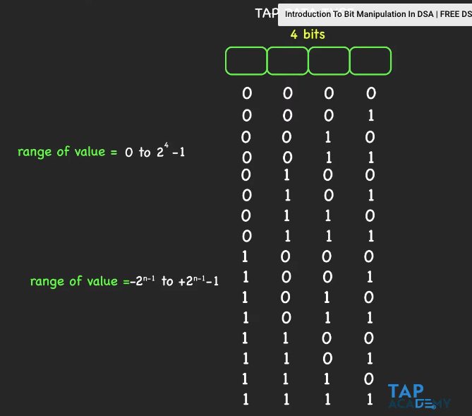
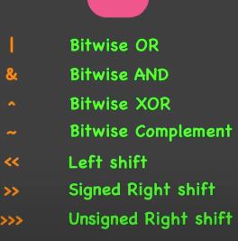
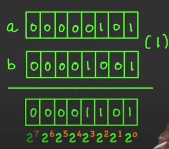

# Bit Manipulation 

### Data Types

What does Data Types do? 

Data type is used to go to the memory and store the required 
amount of RAM.

- '1' byte = '8' bits

Then the data type converts the data into '0' and '1's which are bits. 
Integer values are stored in base '2' format. 

### Convert Decimal to Binary 
Ex. n = 45; //Using Base 2 format
Keep dividing by 2 until you are left with only 1. 

### Convert Binary to Decimal 

Two's Compliment - To handle negative values 
One's Compliment of 1000 -> 0111 
Two's Compliment 0111 + 1 = 1000 -> -7

### Bitwise Operators

#### Bitwise OR (|)
Truth Table
| A | B | Result |
|---|---|--------|
| 0 | 0 | 0      |
| 0 | 1 | 1      |
| 1 | 0 | 1      |
| 1 | 1 | 1      |

A = 0 0 0 0 0 1 0 1  
B = 0 0 0 0 1 0 0 1 (|)  
N = 0 0 0 0 1 1 0 1

what is 5|9 = 13 in bitwise OR

#### Bitwise AND (&)

| A | B | Result | 
|---|---|--------| 
| 0 | 0 | 0      |
| 0 | 1 | 0      |
| 1 | 0 | 0      |
| 1 | 1 | 1      |

A = 0 0 0 0 0 1 0 1  
B = 0 0 0 0 1 0 0 1 (&)  
N = 0 0 0 0 0 0 0 1

#### Bitwise XOR (^)

| A | B | Result | 
|---|---|--------| 
| 0 | 0 | 0      |
| 0 | 1 | 1      |
| 1 | 0 | 1      |
| 1 | 1 | 0      |

A = 0 0 0 0 0 1 0 1  
B = 0 0 0 0 1 0 0 1 (^)  
N = 0 0 0 0 1 1 0 0

#### Bitwise Left Shift Operator

A    => 0 0 0 0 0 1 0 1 -> 5   
A<<1 => 0 0 0 0 1 0 1 0 -> 10  
A<<2 => 0 0 0 1 0 1 0 0 -> 20  

5 * 2 * 2 if A<<2       
5 * 2 if A<<1           
5 * 2 * 2 * 2 if A<<3   

#### Bitwise Right Shift Operator

A    => 0 0 0 0 0 1 0 1 -> 5   
A>>1 => 0 0 0 0 0 0 1 0 -> 10  

5 / 2 if A>>1       

